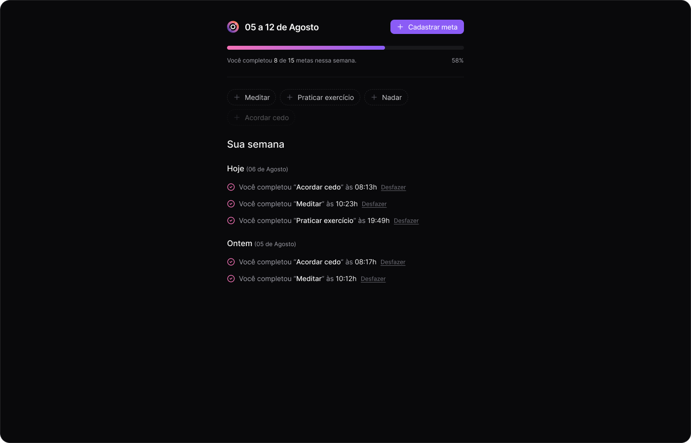

<div align="center">
  <h1>Template Readme</h1>
  <p>in.orbit-web é o cliente web da API in.orbit-api, com fim de realizar o gerenciamento de metas semanais, permitindo o cadastramento da meta, quantidade de dias que será realizada durante a semana, listagem, exibindo as metas da ultima semana baseando-se no dia atual com contagem de dias que a meta foi realizada e permitindo a atualização de metas.</p>
  
</div>

# 📒 Índice
* [Descrição](#descrição)
* [Requisitos Funcionais](#requisitos)
  * [Features](#features)
* [Tecnologias](#tecnologias)
* [Design](#design)
  * [Cores](#cores)
  * [Fontes](#fontes)
  * [Ícones](#ícones)
* [Instalação](#instalação)
* [Licença](#licença)

# 📃 <span id="descrição">Descrição</span>
in.orbit-web é o cliente web da API in.orbit-api, com fim de realizar o gerenciamento de metas semanais, permitindo o cadastramento da meta, quantidade de dias que será realizada durante a semana, listagem, exibindo as metas da ultima semana baseando-se no dia atual com contagem de dias que a meta foi realizada e permitindo a atualização de metas. Utilizando-se de tecnologias com o superset [**TypeScript**](https://www.typescriptlang.org/), com a biblioteca [**React**](https://react.dev/) para web, [**Vite**](https://vitejs.dev/) para o desenvolvimento e o framework CSS [**tailwindcss**](https://tailwindcss.com/) para um layout responsivo e padronizado, [**ReactQuery**](https://tanstack.com/query/latest) para as requisições, [**Zod**](https://github.com/colinhacks/zod) para as validações e [**biomejs**](https://biomejs.dev/) para formatter e linter para a sintaxe.

# 📌 <span id="requisitos">Requisitos Funcionais</span>
- [x] Cadastrar metas para a semana com quantidade de dias para realizar<br>
- [x] Listagem das metas da ultima semana com quantidade de dias que foram completados na semana<br>
- [x] Marcar meta como completa, validando se não foi completada antes e contando os dias de concluído<br>
- [x] Resumo das metas da ultima semana com valor total das mesmas e detalhes de cada uma agrupadas por dia<br>

## Features
- [x] Requisição a API<br>

# 💻 <span id="tecnologias">Tecnologias</span>
- **HTML**
- **CSS**
- **JavaScript**
- **TypeScript**
- **Vite**
- **ReactJS**
- **tailwindcss**
- **tailwind-merge**
- **tailwind-variants**
- **dayjs**
- **lucide-react**
- **@radix-ui**
- **zod**
- **react-hook-form**
- **@hookform/resolvers**
- **@tanstack/react-query**
- **biomejs**

# 🎨 <span id="design">Design</span>
- O modelo final para versão desktop e mobile está disponível na pasta `./design`

- <span id="cores">Cores<br></span>
  * #F472B6<br>
  * #EC4899<br>
  * #F5F3FF<br>
  * #8B5CF6<br>
  * #FAFAFA<br>
  * #F4F4F5<br>
  * #D4D4D8<br>
  * #A1A1AA<br>
  * #71717A<br>
  * #52525B<br>
  * #27272A<br>
  * #18181B<br>
  * #09090B<br>
  * #000000<br>
  * #FFFFFF<br>

- <span id="fontes">Fontes<br></span>
   Arial, sans-serif

- <span id="ícones">Ícones<br></span>
  * Lucid-React

# 🚀 <span id="instalação">Instalação</span>
```bash
  # Clone este repositório:
  $ git clone https://github.com/CleilsonAndrade/in.orbit-web.git
  $ cd ./in.orbit-web

  # Executar:
  $ yarn dev
```

# 📝 <span id="licença">Licença</span>
Esse projeto está sob a licença MIT. Veja o arquivo [LICENSE](LICENSE) para mais detalhes.

---

<p align="center">
  Feito com 💜 by CleilsonAndrade
</p>